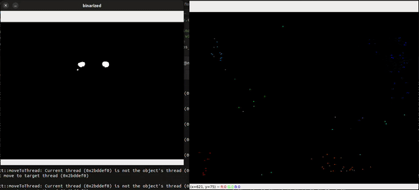

# Optical Flow Boids

This repo is a cool little project. It's a simulation of boids (birds flocks or murmurations) that are influenced by optical flow. The boids are simulated using the [Reynolds Boids algorithm](https://en.wikipedia.org/wiki/Boids) and the optical flow is calculated using the [Farneback method](https://www.geeksforgeeks.org/opencv-the-gunnar-farneback-optical-flow/).

